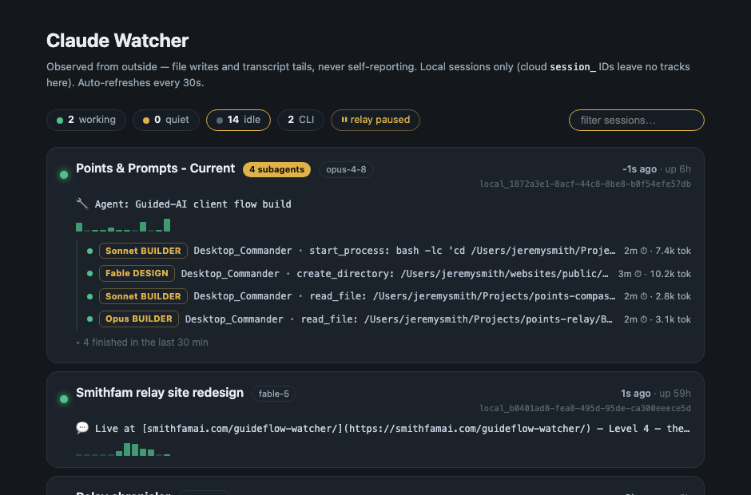

# Claude Watcher

**Is your Claude actually working — or has it been hung for forty minutes while you trusted it?**

A tiny, zero-dependency watcher for every Claude session on your Mac: a live dashboard, a menu bar
glyph, and a one-line "what is it doing right now" per agent — including subagents, with runtimes
and real token spend.



## The idea: observe from outside

Watching the chat tells you almost nothing. A session can look busy while doing nothing, or look
silent while a subagent grinds through a 15-minute build. And you can't ask a session how it's
doing: **a session can be wrong about itself, and a hung one can't answer at all.**

So this never asks. A ~250-line Python script observes from outside, every 60 seconds:

- **A working session constantly writes files; a stalled one doesn't.** Newest file mtime = truth.
- **Every step is logged to a transcript on disk.** The tail of that transcript says what each
  agent — and each of its subagents — is doing *right now*, who it is ("Sonnet BUILDER",
  "Opus SPEC"), how long it's been running, and how many tokens it has spent.

No hooks, no instrumentation, no server, no database, **zero tokens at runtime**. The sessions
never know they're being watched — which is exactly why a hung one can't hide.

## What you get

| Surface | What it shows |
|---|---|
| **Dashboard** (`~/.claude-watcher/index.html` — bookmark it) | Filter chips (working / quiet / idle / CLI) with live search · one card per session with model, uptime, last activity · per-subagent role chips, runtimes, token spend · an hourly activity sparkline · finished subagents collapsed · a stale-feed alarm |
| **Menu bar** (SwiftBar) | 🟢 2 = two sessions actively working · 🟡 quiet · ⚪️ idle · 🔴 the watcher itself died. Dropdown mirrors the dashboard. |
| **status.json** | The machine-readable feed, if you want to build your own surface. |

Covers **Cowork** (Claude desktop agent) sessions *and* **Claude Code CLI** runs
(`~/.claude/projects`). Cloud sessions (`session_…` IDs) are invisible by design — they run in
Anthropic's sandbox and leave no tracks on your disk.

## Install (two commands)

```sh
git clone https://github.com/jeremyinthebay/claude-watcher && cd claude-watcher
./install.sh
```

That loads a 60-second launchd job and prints the dashboard path. Menu bar is optional:

```sh
brew install --cask swiftbar
defaults write com.ameba.SwiftBar PluginDirectory "$PWD/swiftbar"
open -a SwiftBar
```

Config via env vars: `CW_OUT` (output dir), `CW_RELAY_DIR` (an automation dir with `.stop`/`.halt`
kill-switch files to surface), `CW_URL` (point the menu bar at another machine's feed).

## Or build it yourself, with Claude

This project started as prompts, not code. The `prompts/` folder contains the four master prompts
that build the whole thing from scratch in a Claude session — dashboard, menu bar, mission-control
upgrades, and a multi-agent driver mode — each with verification steps and the traps we hit so
your Claude doesn't rediscover them.

## The traps (read before modifying)

1. **Shell-quoting**: the SwiftBar plugin's Python rides inside a single-quoted bash string — use
   only double quotes in that Python. One stray `s['key']` produces an impossible-looking NameError.
2. **Old Python**: macOS system `python3` can't nest same-quote f-strings. Assign to a variable,
   then interpolate.
3. **`|` is SwiftBar's parameter separator** — strip it from all dynamic text.
4. **Never fixed-width-slice ISO timestamps** — fractional seconds make `fromisoformat` fail
   silently, and the symptom is an all-zero sparkline that looks plausible. Find the closing quote.
5. **Two clocks beat one**: session age is `max(newest file mtime, metadata lastActivityAt)` — a
   capped directory walk can miss the hot file and report a working session as a day old.

## FAQ

**Does it spend tokens?** No. It's a Python script reading files. The AI is the thing being
watched, not the thing watching.

**Privacy?** Everything stays on your Mac by default. The "doing" lines contain shell commands and
file paths — if you publish `status.json` anywhere, decide that on purpose.

**Why not hooks?** Hook-based monitors (which are great — see
[Claude-Code-Agent-Monitor](https://github.com/hoangsonww/Claude-Code-Agent-Monitor),
[agents-observe](https://github.com/simple10/agents-observe)) require instrumenting each session
and can't see sessions you didn't configure. This sees everything on the disk, including the
scheduled 3 a.m. session you forgot about.

---

Built with Claude, on a Mac mini that also [ships its own website](https://smithfamai.com/points-problem/).
MIT. Part of the [relay-skills](https://github.com/jeremyinthebay/relay-skills) family.
